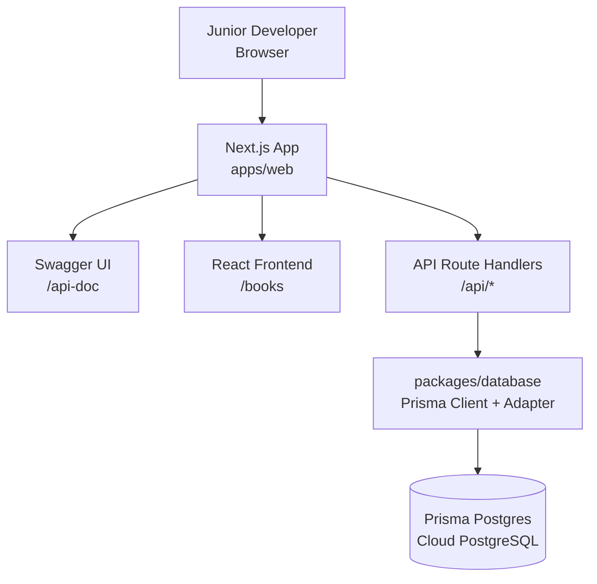
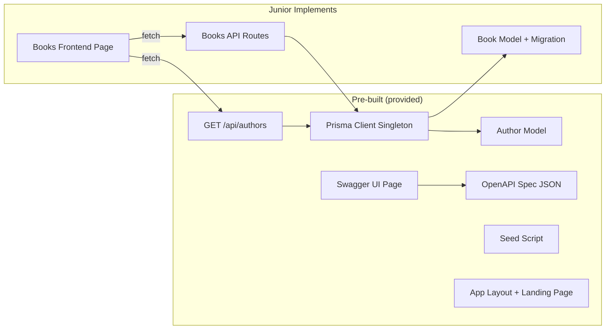
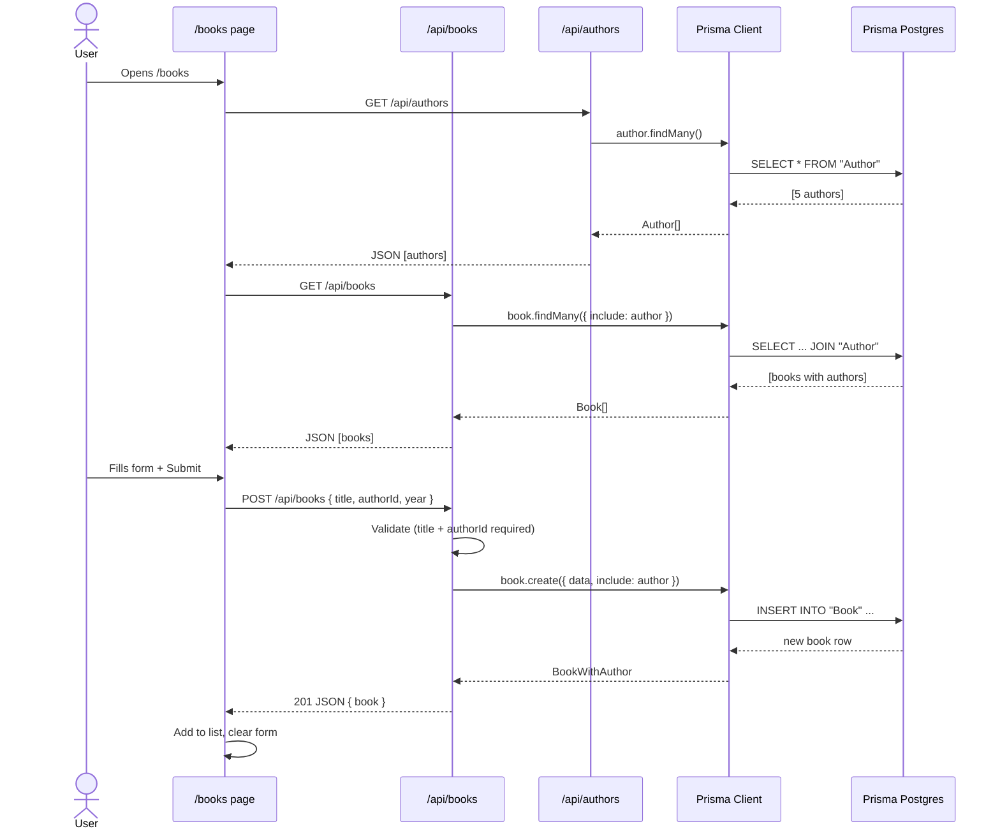
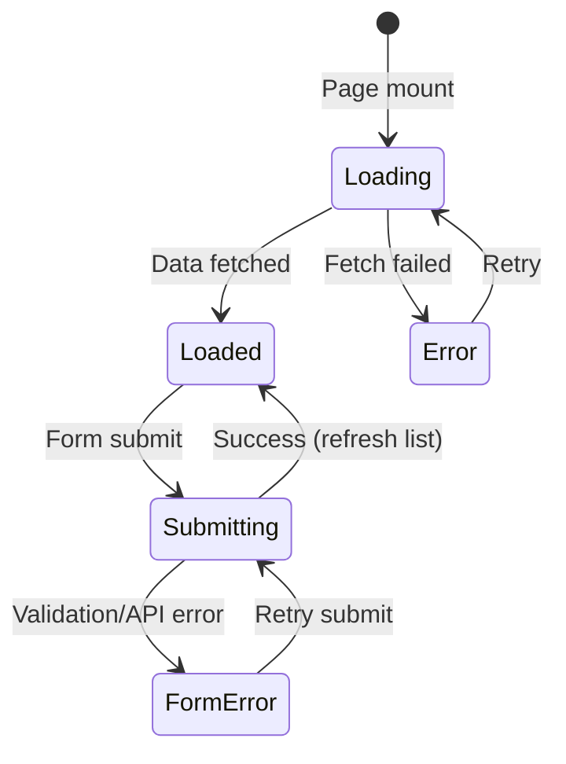

# Solution Design Document

## Validation Checklist

### CRITICAL GATES (Must Pass)

- [x] All required sections are complete
- [x] No [NEEDS CLARIFICATION] markers remain
- [x] Architecture pattern is clearly stated with rationale
- [x] **All architecture decisions confirmed by user**
- [x] Every interface has specification

### QUALITY CHECKS (Should Pass)

- [x] All context sources are listed with relevance ratings
- [x] Project commands are discovered from actual project files
- [x] Constraints → Strategy → Design → Implementation path is logical
- [x] Every component in diagram has directory mapping
- [x] Error handling covers all error types
- [x] Quality requirements are specific and measurable
- [x] Component names consistent across diagrams
- [x] A developer could implement from this design
- [x] Implementation examples use actual schema column names
- [x] Complex queries include traced walkthroughs with example data

---

## Constraints

CON-1 **Framework**: Next.js (App Router) with TypeScript, Prisma ORM, Prisma Postgres (cloud-hosted PostgreSQL)
CON-2 **Audience**: Junior developers — all pre-built code must be simple, readable, and serve as a learning reference
CON-3 **Setup**: Single `pnpm setup` command bootstraps the project (install, generate, migrate, seed). Junior creates a free Prisma Postgres DB beforehand (guided in README).
CON-4 **Scope split**: Author entity is pre-built (reference implementation); Book entity is built by the junior dev
CON-5 **Monorepo**: pnpm workspaces with `apps/web` (Next.js) and `packages/database` (Prisma schema, client, seed)
CON-6 **Documentation**: German README, OpenAPI/Swagger UI for API exploration in browser
CON-7 **Package manager**: pnpm

## Implementation Context

### Required Context Sources

#### Documentation Context
```yaml
- doc: README.md
  relevance: HIGH
  why: "German step-by-step guide for junior developers — primary entry point"

- doc: packages/database/prisma/schema.prisma
  relevance: CRITICAL
  why: "Database schema with Author model (pre-built) and Book model (junior implements)"

- url: https://www.prisma.io/docs/prisma-postgres/quickstart/prisma-orm
  relevance: HIGH
  why: "Prisma Postgres setup guide — junior follows this to create their DB"

- url: https://www.prisma.io/docs/orm/prisma-schema
  relevance: MEDIUM
  why: "Prisma schema reference for junior developers"

- url: https://nextjs.org/docs/app/building-your-application/routing/route-handlers
  relevance: MEDIUM
  why: "Next.js App Router route handler documentation"
```

#### Code Context
```yaml
- file: package.json (root)
  relevance: HIGH
  why: "Root workspace config, setup script"

- file: apps/web/package.json
  relevance: HIGH
  why: "Next.js app dependencies and scripts"

- file: packages/database/package.json
  relevance: HIGH
  why: "Prisma dependencies, seed script, database package exports"

- file: packages/database/src/client.ts
  relevance: HIGH
  why: "Prisma Client singleton with PrismaPg adapter — shared by all API routes"

- file: apps/web/src/app/api/authors/route.ts
  relevance: CRITICAL
  why: "Reference implementation — junior copies this pattern for books"

- file: apps/web/src/app/api-doc/page.tsx
  relevance: MEDIUM
  why: "Swagger UI page for browsing API documentation"
```

### Implementation Boundaries

- **Must Preserve**: Author model, Author API route, seed data, setup script, Prisma client singleton with adapter, OpenAPI spec, Swagger UI page, pnpm workspace config
- **Can Modify**: Book-related files (schema model, API routes, frontend components) — this is what the junior dev builds
- **Must Not Touch**: Next.js config, TypeScript config, Prisma datasource config, packages/database/src/client.ts, pnpm-workspace.yaml

### External Interfaces

#### System Context Diagram



#### Interface Specifications

```yaml
inbound:
  - name: "Browser — Frontend Pages"
    type: HTTP
    format: HTML (React/Next.js)
    authentication: none
    data_flow: "Book management UI, Swagger UI"

  - name: "Browser / Swagger UI — API"
    type: HTTP
    format: REST JSON
    authentication: none
    data_flow: "CRUD operations on books and authors"

data:
  - name: "Prisma Postgres"
    type: PostgreSQL (cloud-hosted, managed)
    connection: "postgres://... via @prisma/adapter-pg"
    data_flow: "Author and Book persistence"
```

### Project Commands

```bash
# Core Commands (root)
Setup:   pnpm setup       # install + prisma generate + db push + seed (all workspaces)
Dev:     pnpm dev         # next dev via workspace (http://localhost:3000)
Lint:    pnpm lint        # next lint via workspace

# Database (run from packages/database or use pnpm --filter database)
Generate: pnpm --filter database generate    # regenerate Prisma client after schema changes
Migrate:  pnpm --filter database migrate     # create + apply migration (junior runs this)
Studio:   pnpm --filter database studio      # visual database browser (Prisma Studio)
Seed:     pnpm --filter database seed        # insert author seed data
```

## Solution Strategy

- **Architecture Pattern**: pnpm monorepo with two workspaces — `apps/web` (Next.js app with API routes and frontend) and `packages/database` (Prisma schema, client, seed). API route handlers import the Prisma client from the shared database package.
- **Integration Approach**: Monorepo-internal — frontend pages and API routes live in `apps/web`, database access is encapsulated in `packages/database`. Frontend fetches from `/api/*` endpoints using plain `fetch`.
- **Justification**: Teaches monorepo structure (a real-world pattern) while keeping complexity minimal. Two workspaces are easy to reason about. The database package is a clean separation that the junior can understand. One `pnpm dev` starts everything.
- **Key Decisions**:
  - pnpm workspaces for monorepo structure
  - App Router with Route Handlers (named exports per HTTP method)
  - Prisma Postgres (cloud-hosted PostgreSQL) — modern, managed, no local DB setup
  - `@prisma/adapter-pg` driver adapter for Prisma Client
  - Author as pre-built reference pattern; Book left for junior
  - OpenAPI spec pre-built describing the expected API; Swagger UI page pre-built for browser-based API testing
  - Plain `fetch` + `useState`/`useEffect` for frontend (no data-fetching libraries)

## Building Block View

### Components



### Directory Map

```
fullstack-challenge/
├── package.json                              # PREBUILT: root workspace config + setup script
├── pnpm-workspace.yaml                       # PREBUILT: defines apps/* and packages/* workspaces
├── .env.example                              # PREBUILT: DATABASE_URL placeholder
├── .env                                      # JUNIOR CREATES: copies .env.example, adds their DB URL
├── README.md                                 # PREBUILT: German guide with tasks
├── tsconfig.json                             # PREBUILT: root TypeScript config (shared)
│
├── packages/
│   └── database/
│       ├── package.json                      # PREBUILT: prisma deps, scripts (generate, migrate, seed, studio)
│       ├── tsconfig.json                     # PREBUILT: TypeScript config for database package
│       ├── prisma/
│       │   └── schema.prisma                 # PREBUILT: datasource (postgresql) + Author model
│       │                                     # JUNIOR MODIFIES: adds Book model here
│       ├── src/
│       │   ├── client.ts                     # PREBUILT: Prisma Client singleton with PrismaPg adapter
│       │   └── index.ts                      # PREBUILT: re-exports prisma client + generated types
│       ├── generated/                        # GENERATED: Prisma Client output (prisma-client generator)
│       │   └── prisma/
│       └── seed.ts                           # PREBUILT: seeds Author data
│
├── apps/
│   └── web/
│       ├── package.json                      # PREBUILT: next.js deps + dependency on @repo/database
│       ├── tsconfig.json                     # PREBUILT: TypeScript config extending root
│       ├── next.config.ts                    # PREBUILT: Next.js config (transpilePackages for monorepo)
│       └── src/
│           ├── app/
│           │   ├── layout.tsx                # PREBUILT: root layout with navigation
│           │   ├── page.tsx                  # PREBUILT: landing page with instructions
│           │   │
│           │   ├── api/
│           │   │   ├── authors/
│           │   │   │   └── route.ts          # PREBUILT: GET all authors (reference impl)
│           │   │   └── books/
│           │   │       ├── route.ts          # JUNIOR CREATES: GET all + POST new book
│           │   │       └── [id]/
│           │   │           └── route.ts      # JUNIOR CREATES: GET one + PUT + DELETE book
│           │   │
│           │   ├── api-doc/
│           │   │   └── page.tsx              # PREBUILT: Swagger UI page
│           │   │
│           │   └── books/
│           │       └── page.tsx              # JUNIOR CREATES: book management UI
│           │
│           └── lib/
│               └── swagger.ts                # PREBUILT: OpenAPI spec object
```

### Interface Specifications

#### Data Storage — Prisma Schema

```prisma
// packages/database/prisma/schema.prisma

datasource db {
  provider = "postgresql"
  url      = env("DATABASE_URL")
}

generator client {
  provider = "prisma-client"
  output   = "../generated/prisma"
}

// PREBUILT — Author model (reference implementation)
model Author {
  id    Int    @id @default(autoincrement())
  name  String
  books Book[] // ← relation added AFTER junior creates Book model
}

// JUNIOR IMPLEMENTS — Book model
model Book {
  id       Int     @id @default(autoincrement())
  title    String
  isbn     String? @unique
  year     Int?
  authorId Int
  author   Author  @relation(fields: [authorId], references: [id])
}
```

**Important schema notes**:
- Uses the ESM-first `prisma-client` generator with custom output to `../generated/prisma`
- The Author model initially ships WITHOUT the `books Book[]` line. The junior adds this relation field on the Author side when they create the Book model. The README explains this.
- PostgreSQL provider connects to Prisma Postgres (cloud-hosted). The `DATABASE_URL` comes from the junior's `.env` file.

#### Seed Data (Pre-built)

```typescript
// packages/database/seed.ts — Authors to pre-seed
import { prisma } from "./src/client";

const authors = [
  { id: 1, name: "J.K. Rowling" },
  { id: 2, name: "George Orwell" },
  { id: 3, name: "Jane Austen" },
  { id: 4, name: "Franz Kafka" },
  { id: 5, name: "Hermann Hesse" },
];
```

Uses `upsert` for idempotency — safe to run multiple times.

#### Internal API — OpenAPI Specification

The OpenAPI spec is pre-built in `src/lib/swagger.ts` and describes the **expected** API that the junior will implement. This serves as both documentation and a testing tool via Swagger UI.

```yaml
openapi: "3.0.0"
info:
  title: "Book Management API"
  description: "API für die Buchverwaltung — Teil der Fullstack Challenge"
  version: "1.0.0"

paths:
  /api/authors:
    get:
      summary: "Alle Autoren abrufen"
      description: "Gibt eine Liste aller Autoren zurück (vorgebaut)"
      responses:
        "200":
          description: "Liste der Autoren"
          content:
            application/json:
              schema:
                type: array
                items:
                  $ref: "#/components/schemas/Author"

  /api/books:
    get:
      summary: "Alle Bücher abrufen"
      description: "Gibt eine Liste aller Bücher mit Autor-Informationen zurück"
      responses:
        "200":
          description: "Liste der Bücher"
          content:
            application/json:
              schema:
                type: array
                items:
                  $ref: "#/components/schemas/BookWithAuthor"

    post:
      summary: "Neues Buch erstellen"
      description: "Erstellt ein neues Buch mit Verknüpfung zu einem Autor"
      requestBody:
        required: true
        content:
          application/json:
            schema:
              $ref: "#/components/schemas/CreateBookInput"
      responses:
        "201":
          description: "Buch erfolgreich erstellt"
          content:
            application/json:
              schema:
                $ref: "#/components/schemas/BookWithAuthor"
        "400":
          description: "Ungültige Eingabe (title oder authorId fehlt)"
          content:
            application/json:
              schema:
                $ref: "#/components/schemas/ErrorResponse"

  /api/books/{id}:
    get:
      summary: "Ein Buch abrufen"
      description: "Gibt ein einzelnes Buch mit Autor-Informationen zurück"
      parameters:
        - name: id
          in: path
          required: true
          schema:
            type: integer
      responses:
        "200":
          description: "Das Buch"
          content:
            application/json:
              schema:
                $ref: "#/components/schemas/BookWithAuthor"
        "404":
          description: "Buch nicht gefunden"
          content:
            application/json:
              schema:
                $ref: "#/components/schemas/ErrorResponse"

    put:
      summary: "Buch aktualisieren (Bonus)"
      description: "Aktualisiert ein bestehendes Buch"
      parameters:
        - name: id
          in: path
          required: true
          schema:
            type: integer
      requestBody:
        required: true
        content:
          application/json:
            schema:
              $ref: "#/components/schemas/UpdateBookInput"
      responses:
        "200":
          description: "Buch erfolgreich aktualisiert"
          content:
            application/json:
              schema:
                $ref: "#/components/schemas/BookWithAuthor"
        "404":
          description: "Buch nicht gefunden"

    delete:
      summary: "Buch löschen"
      description: "Löscht ein Buch anhand der ID"
      parameters:
        - name: id
          in: path
          required: true
          schema:
            type: integer
      responses:
        "200":
          description: "Buch erfolgreich gelöscht"
          content:
            application/json:
              schema:
                $ref: "#/components/schemas/BookWithAuthor"
        "404":
          description: "Buch nicht gefunden"
          content:
            application/json:
              schema:
                $ref: "#/components/schemas/ErrorResponse"

components:
  schemas:
    Author:
      type: object
      properties:
        id:
          type: integer
        name:
          type: string

    Book:
      type: object
      properties:
        id:
          type: integer
        title:
          type: string
        isbn:
          type: string
          nullable: true
        year:
          type: integer
          nullable: true
        authorId:
          type: integer

    BookWithAuthor:
      allOf:
        - $ref: "#/components/schemas/Book"
        - type: object
          properties:
            author:
              $ref: "#/components/schemas/Author"

    CreateBookInput:
      type: object
      required:
        - title
        - authorId
      properties:
        title:
          type: string
        authorId:
          type: integer
        isbn:
          type: string
        year:
          type: integer

    UpdateBookInput:
      type: object
      properties:
        title:
          type: string
        authorId:
          type: integer
        isbn:
          type: string
        year:
          type: integer

    ErrorResponse:
      type: object
      properties:
        error:
          type: string
```

#### Swagger UI Integration

The OpenAPI spec is served as a JavaScript object from `src/lib/swagger.ts`. The Swagger UI page at `/api-doc` renders it using the `swagger-ui-react` package.

```yaml
# Dependencies for OpenAPI/Swagger
- package: swagger-ui-react
  version: "^5.x"
  why: "Renders OpenAPI spec as interactive API documentation in the browser"

- package: "@types/swagger-ui-react" (devDependency)
  version: "^4.x"
  why: "TypeScript types for swagger-ui-react"
```

#### Application Data Models

```pseudocode
ENTITY: Author (PREBUILT)
  FIELDS:
    id: Int (PK, autoincrement)
    name: String
    books: Book[] (relation — added after Book model exists)

ENTITY: Book (JUNIOR IMPLEMENTS)
  FIELDS:
    id: Int (PK, autoincrement)
    title: String (required)
    isbn: String (optional, unique)
    year: Int (optional)
    authorId: Int (FK → Author.id, required)
    author: Author (relation)
```

### Implementation Examples

#### Example: Prisma Client Singleton with Adapter (Pre-built)

**Why this example**: Prisma Postgres requires the `@prisma/adapter-pg` driver adapter. Next.js hot-reloads in dev mode, so a singleton pattern prevents multiple client instances. The junior doesn't write this but imports it via `@repo/database`.

```typescript
// packages/database/src/client.ts
import { PrismaPg } from "@prisma/adapter-pg";
import { PrismaClient } from "../generated/prisma/client.js";

const globalForPrisma = globalThis as unknown as {
  prisma: PrismaClient | undefined;
};

function createPrismaClient() {
  const adapter = new PrismaPg({ connectionString: process.env.DATABASE_URL });
  return new PrismaClient({ adapter });
}

export const prisma = globalForPrisma.prisma ?? createPrismaClient();

if (process.env.NODE_ENV !== "production") globalForPrisma.prisma = prisma;
```

```typescript
// packages/database/src/index.ts — re-exports for consuming packages
export { prisma } from "./client.js";
export * from "../generated/prisma/client.js";
```

#### Example: Author API Route (Pre-built Reference)

**Why this example**: This is the exact pattern the junior will copy for Book routes. Shows how to import from the shared `@repo/database` package.

```typescript
// apps/web/src/app/api/authors/route.ts
import { NextResponse } from "next/server";
import { prisma } from "@repo/database";

export async function GET() {
  const authors = await prisma.author.findMany();
  return NextResponse.json(authors);
}
```

#### Example: Expected Book API Route (What Junior Builds)

**Why this example**: Shows the target implementation for the junior. Not provided in the codebase — the junior writes this from scratch using the Author route as reference.

```typescript
// apps/web/src/app/api/books/route.ts — JUNIOR IMPLEMENTS
import { NextRequest, NextResponse } from "next/server";
import { prisma } from "@repo/database";

// GET /api/books — List all books with author
export async function GET() {
  const books = await prisma.book.findMany({
    include: { author: true },
  });
  return NextResponse.json(books);
}

// POST /api/books — Create a new book
export async function POST(request: NextRequest) {
  const body = await request.json();
  const { title, authorId, isbn, year } = body;

  if (!title || !authorId) {
    return NextResponse.json(
      { error: "title und authorId sind erforderlich" },
      { status: 400 }
    );
  }

  const book = await prisma.book.create({
    data: { title, authorId, isbn, year },
    include: { author: true },
  });

  return NextResponse.json(book, { status: 201 });
}
```

**Traced walkthrough — POST /api/books:**

| Step | Input | Result |
|------|-------|--------|
| 1. Parse body | `{ title: "1984", authorId: 2, year: 1949 }` | Destructure fields |
| 2. Validate | `title="1984"`, `authorId=2` | Both present → continue |
| 3. Create | `prisma.book.create({ data: { title: "1984", authorId: 2, year: 1949 }, include: { author: true } })` | New row: `{ id: 1, title: "1984", authorId: 2, year: 1949, author: { id: 2, name: "George Orwell" } }` |
| 4. Return | 201 + JSON body | Book with nested author |

**Edge case — missing title:**

| Step | Input | Result |
|------|-------|--------|
| 1. Parse body | `{ authorId: 2 }` | `title` is undefined |
| 2. Validate | `!title` → true | Return 400: `{ error: "title und authorId sind erforderlich" }` |

#### Example: Swagger UI Page (Pre-built)

**Why this example**: Shows how the OpenAPI spec is rendered in the browser. Pre-built for the junior.

```typescript
// apps/web/src/app/api-doc/page.tsx
"use client";

import SwaggerUI from "swagger-ui-react";
import "swagger-ui-react/swagger-ui.css";
import { openApiSpec } from "@/lib/swagger";

export default function ApiDocPage() {
  return (
    <div style={{ padding: "20px" }}>
      <SwaggerUI spec={openApiSpec} />
    </div>
  );
}
```

#### Example: OpenAPI Spec Module (Pre-built)

**Why this example**: The spec is a plain JavaScript object exported from a module. No YAML parsing needed.

```typescript
// apps/web/src/lib/swagger.ts
export const openApiSpec = {
  openapi: "3.0.0",
  info: {
    title: "Book Management API",
    description: "API für die Buchverwaltung — Teil der Fullstack Challenge",
    version: "1.0.0",
  },
  paths: {
    // ... full spec as defined in the OpenAPI section above
  },
  components: {
    // ... schemas as defined above
  },
};
```

## Runtime View

### Primary Flow: Add a Book

1. Junior opens `/books` in browser
2. React page fetches `GET /api/authors` and `GET /api/books` on mount
3. Author data populates the dropdown; book data populates the list
4. Junior fills form: title="Der Prozess", author=Franz Kafka, year=1925
5. Frontend calls `POST /api/books` with `{ title: "Der Prozess", authorId: 4, year: 1925 }`
6. Route handler validates input, creates book via Prisma, returns 201 with book+author
7. Frontend adds book to list, clears form



### Primary Flow: Delete a Book

1. User clicks "Löschen" button on a book row
2. Browser `confirm()` dialog asks for confirmation
3. On confirm, frontend calls `DELETE /api/books/[id]`
4. Route handler deletes via Prisma, returns the deleted book
5. Frontend removes book from list

### Error Handling

- **Invalid input (POST with missing fields)**: Route handler returns 400 with `{ error: "descriptive message" }`. Frontend displays error near the form.
- **Not found (DELETE/GET with bad ID)**: Route handler returns 404 with `{ error: "Buch nicht gefunden" }`. Frontend displays error message.
- **Prisma error (e.g., unique constraint on ISBN)**: Prisma throws, route handler catches and returns 400 with error message.
- **Network failure**: Frontend shows generic error message. No retry logic needed.
- **Authors fail to load**: Form is disabled or shows loading indicator.

## Deployment View

Local development only — database is cloud-hosted (Prisma Postgres).

- **Environment**: Local machine, `pnpm dev` serves on `http://localhost:3000`
- **Configuration**: `.env` at project root with `DATABASE_URL="postgres://..."` (junior creates via `npx prisma init --db`)
- **Dependencies**: Node.js 18+, pnpm — Prisma Postgres account (free tier)
- **Database**: Prisma Postgres (cloud-hosted PostgreSQL, scales to zero) — created by junior as first step following README instructions

## Cross-Cutting Concepts

### User Interface & UX

**Information Architecture:**
- Navigation: Simple top nav with links → Home (`/`), Bücher (`/books`), API Docs (`/api-doc`)
- Content Organization: Single-page book management with form above list

**UI Layout — Books Page:**
```
┌─────────────────────────────────────────────┐
│  📚 Buchverwaltung        Home | Bücher | API │
├─────────────────────────────────────────────┤
│                                             │
│  Neues Buch hinzufügen                      │
│  ┌─────────────────────────────────────┐    │
│  │ Titel:    [________________]        │    │
│  │ Autor:    [▼ Autor wählen  ]        │    │
│  │ ISBN:     [________________]        │    │
│  │ Jahr:     [____]                    │    │
│  │                                     │    │
│  │          [Buch hinzufügen]          │    │
│  └─────────────────────────────────────┘    │
│                                             │
│  ┌─────────────────────────────────────┐    │
│  │ Titel      │ Autor        │ Jahr │  │    │
│  ├────────────┼──────────────┼──────┤  │    │
│  │ 1984       │ George Orwell│ 1949 │ 🗑│    │
│  │ Der Prozess│ Franz Kafka  │ 1925 │ 🗑│    │
│  └─────────────────────────────────────┘    │
│                                             │
│  (oder: "Noch keine Bücher vorhanden.")     │
└─────────────────────────────────────────────┘
```

**Interaction Design:**
- State Management: `useState` for books list, authors list, form fields, error message, form mode (add/edit)
- Feedback: Error messages in red text near form. No toast/notification library.
- Accessibility: HTML `required` attributes on title and author select. Semantic HTML (`<table>`, `<form>`, `<label>`).

**Component States:**


### System-Wide Patterns

- **Security**: None required — coding challenge, no auth. `DATABASE_URL` is in `.env` (gitignored). No secrets in client code.
- **Error Handling**: Each API route handles its own errors. Frontend shows error strings. No global error boundary needed.
- **Performance**: Not relevant — tiny dataset. Prisma Postgres latency is acceptable for a dev exercise.
- **Logging**: Console only (default Next.js behavior). No custom logging.

## Architecture Decisions

- [x] **ADR-1 App Router with Route Handlers**: Use Next.js App Router (`app/` directory) with named function exports (`GET`, `POST`, `DELETE`) instead of Pages Router
  - Rationale: Named exports per HTTP method are simpler than `switch(req.method)`. App Router is the current standard. Better docs/community support going forward.
  - Trade-offs: App Router has more concepts (server components, `"use client"`), but for this challenge we keep pages simple with client components where needed.
  - User confirmed: **Yes**

- [x] **ADR-2 Prisma Postgres (Cloud PostgreSQL)**: Use Prisma Postgres as the database — a managed, cloud-hosted PostgreSQL that scales to zero
  - Rationale: Teaches real-world database workflow (connection strings, cloud DB). Prisma Postgres has a free tier. No Docker or local Postgres installation needed. Junior creates their own DB instance as part of the challenge setup — this is itself a learning experience.
  - Trade-offs: Requires internet connection and a free Prisma account. Slightly more setup friction than SQLite, but the README guides through it step by step.
  - User confirmed: **Yes**

- [x] **ADR-3 Author as Reference Implementation**: Pre-build a complete Author entity (model, migration, seed, API route) as a copyable pattern
  - Rationale: Junior developers learn best by example. Having a working Author implementation to study and replicate for Book dramatically reduces "blank page" paralysis and teaches the exact patterns used in this project.
  - Trade-offs: The Author route is intentionally simple (GET only) to not overwhelm.
  - User confirmed: **Yes**

- [x] **ADR-4 `prisma db push` for Setup, `prisma migrate dev` for Junior**: Use `db push` in the setup script (no migration files for Author) and require the junior to use `migrate dev` for Book
  - Rationale: `db push` is simpler for bootstrapping — no migration history needed for the initial schema. The junior using `migrate dev` for Book is a core learning objective: understanding the migration workflow.
  - Trade-offs: Mixing `db push` and `migrate dev` can sometimes conflict. Mitigated by the junior running `migrate dev` after setup is complete (additive change only).
  - User confirmed: **Yes**

- [x] **ADR-5 Plain `fetch` + React State**: Use native `fetch` API with `useState`/`useEffect` for data fetching — no SWR, React Query, or form libraries
  - Rationale: The challenge tests fundamental React skills. Data-fetching libraries add abstraction that obscures what's actually happening. `fetch` + state is sufficient and teachable.
  - Trade-offs: More boilerplate than SWR/React Query. Acceptable for this scope.
  - User confirmed: **Yes**

- [x] **ADR-6 OpenAPI Spec + Swagger UI**: Pre-build an OpenAPI 3.0 spec and a `/api-doc` page with `swagger-ui-react`
  - Rationale: Provides interactive API documentation the junior can use to test their endpoints directly in the browser. Also serves as a specification of the expected API contract. German descriptions help the junior understand what each endpoint should do.
  - Trade-offs: Adds `swagger-ui-react` dependency (~2MB). Worth it for the DX improvement.
  - User confirmed: **Yes**

- [x] **ADR-7 pnpm Workspaces Monorepo**: Use pnpm workspaces with two packages — `apps/web` (Next.js) and `packages/database` (Prisma)
  - Rationale: Teaches monorepo structure (a common real-world pattern at innFactory). Clean separation between app and database concerns. The `@repo/database` import pattern is a simple, learnable concept. pnpm is fast and has strict dependency isolation.
  - Trade-offs: Adds workspace configuration overhead. Mitigated by pre-building all workspace config (pnpm-workspace.yaml, package.json files, tsconfig references).
  - User confirmed: **Yes**

- [x] **ADR-8 Latest Dependencies**: Use the latest stable versions of all dependencies at time of implementation
  - Rationale: Ensures the junior works with current documentation and avoids deprecated APIs. Modern versions have better DX.
  - Trade-offs: Latest versions may have fewer StackOverflow answers. Mitigated by the reference implementation and README providing all needed patterns.
  - User confirmed: **Yes**

## Quality Requirements

- **Startup time**: `pnpm setup` completes in < 90 seconds on a typical machine (includes Prisma generate + db push + seed to cloud DB)
- **Dev server**: `pnpm dev` starts and serves the app in < 10 seconds
- **API response**: All API endpoints respond in < 500ms (cloud DB latency included)
- **Usability**: A junior developer with basic TypeScript/React knowledge can complete the challenge in 2-4 hours using only the README
- **Reliability**: Re-running `pnpm setup` is idempotent (safe to run multiple times)

## Acceptance Criteria (EARS Format)

**Setup & Bootstrap:**
- [x] WHEN `pnpm setup` is executed after the junior has configured `.env` with their Prisma Postgres URL, THE SYSTEM SHALL install dependencies, generate Prisma client, push the Author schema to the cloud DB, and seed 5 authors
- [x] WHEN `pnpm dev` is executed after setup, THE SYSTEM SHALL start the Next.js dev server on port 3000 with a working landing page

**Pre-built Reference:**
- [x] WHEN GET `/api/authors` is called, THE SYSTEM SHALL return a JSON array of all seeded authors with `id` and `name` fields
- [x] WHEN `/api-doc` is opened in a browser, THE SYSTEM SHALL render Swagger UI with the full OpenAPI specification for all expected endpoints

**Junior Implementation — Migration:**
- [x] WHEN the junior adds a Book model to `packages/database/prisma/schema.prisma` and runs the migrate command, THE SYSTEM SHALL create a migration file and apply it to the Prisma Postgres database
- [x] WHEN the migration is applied, THE SYSTEM SHALL create a Book table with columns: `id`, `title`, `isbn`, `year`, `authorId` (FK to Author)

**Junior Implementation — API:**
- [x] WHEN GET `/api/books` is called, THE SYSTEM SHALL return all books with nested author objects
- [x] WHEN POST `/api/books` is called with valid `{ title, authorId }`, THE SYSTEM SHALL create the book and return it with status 201
- [x] IF POST `/api/books` is called without `title` or `authorId`, THEN THE SYSTEM SHALL return status 400 with an error message
- [x] WHEN DELETE `/api/books/{id}` is called with a valid ID, THE SYSTEM SHALL delete the book and return a success response
- [x] IF DELETE `/api/books/{id}` is called with a non-existent ID, THEN THE SYSTEM SHALL return status 404

**Junior Implementation — Frontend:**
- [x] WHEN the `/books` page loads, THE SYSTEM SHALL fetch and display all books in a list/table
- [x] WHILE no books exist, THE SYSTEM SHALL display an empty state message
- [x] WHEN the user submits the add-book form, THE SYSTEM SHALL call POST `/api/books` and add the new book to the displayed list
- [x] WHEN the user clicks delete on a book, THE SYSTEM SHALL confirm via dialog, then call DELETE `/api/books/{id}` and remove the book from the list

## Risks and Technical Debt

### Known Technical Issues
- None — greenfield project

### Technical Debt
- None — intentionally kept minimal for a coding challenge

### Implementation Gotchas
- **Prisma Client regeneration**: After the junior modifies `schema.prisma`, they must run `pnpm --filter database generate` (or the migrate command which does it automatically) before the TypeScript types update. The README must mention this.
- **`db push` + `migrate dev` interaction**: If the junior runs `prisma db push` instead of `migrate dev`, no migration file is created. The README must clearly instruct to use `migrate dev`.
- **`"use client"` directive**: The books page needs `"use client"` at the top because it uses `useState`/`useEffect`. The Swagger UI page already demonstrates this pattern.
- **Author relation field**: The junior must add `books Book[]` to the Author model when creating the Book model. Prisma will error if the back-relation is missing. The README should hint at this.
- **Prisma Postgres connection**: The junior must create a free Prisma Postgres database and add the connection string to `.env`. The README must have clear German instructions for this step, including screenshots or exact CLI commands.
- **pnpm workspace imports**: The `@repo/database` package import in `apps/web` requires `transpilePackages: ["@repo/database"]` in `next.config.ts`. This is pre-built but the junior should be aware if they see module resolution errors.
- **`.env` location**: The `.env` file lives at the project root. Prisma reads it from where the CLI is invoked. The `packages/database/package.json` scripts should ensure `dotenv` loads from the root using `--env-path` or by configuring the schema to look in the right place.

## Glossary

### Domain Terms

| Term | Definition | Context |
|------|------------|---------|
| Buch (Book) | A published work with a title, optional ISBN, and publication year | The primary entity the junior developer creates |
| Autor (Author) | A person who writes books | Pre-seeded reference entity with a one-to-many relation to Book |
| Migration | A versioned database schema change tracked by Prisma | Core learning objective — junior creates a migration for the Book table |

### Technical Terms

| Term | Definition | Context |
|------|------------|---------|
| Prisma | TypeScript-first ORM for Node.js | Database access layer, schema definition, migrations |
| Prisma Postgres | Managed cloud PostgreSQL by Prisma that scales to zero | Database hosting — junior creates a free instance |
| PrismaPg Adapter | Driver adapter connecting Prisma Client to PostgreSQL | Required for Prisma Postgres — `@prisma/adapter-pg` |
| pnpm | Fast, disk-space efficient package manager | Project package manager, manages workspace dependencies |
| pnpm Workspaces | Monorepo feature of pnpm linking local packages | `apps/web` depends on `packages/database` via `workspace:*` |
| Route Handler | Next.js App Router convention for API endpoints | Files named `route.ts` in `app/api/` directory, export named functions per HTTP method |
| Prisma Studio | Visual database browser built into Prisma | Used by junior to verify migration and inspect data |
| OpenAPI | Standard specification format for REST APIs | Pre-built spec describes the expected API contract |
| Swagger UI | Interactive API documentation viewer | Renders OpenAPI spec at `/api-doc` for browser-based API testing |
| `@repo/database` | Internal workspace package name | How `apps/web` imports the Prisma client and types from `packages/database` |

### API/Interface Terms

| Term | Definition | Context |
|------|------------|---------|
| `include` | Prisma query option to eager-load relations | Used in `findMany({ include: { author: true } })` to return books with nested author |
| `upsert` | Create-or-update database operation | Used in seed script for idempotent author insertion |
| `transpilePackages` | Next.js config for monorepo packages | Ensures `@repo/database` is transpiled correctly by Next.js |
